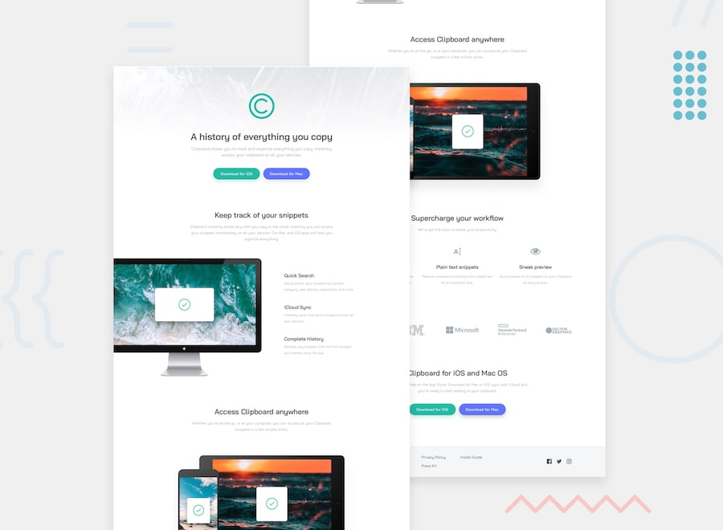

# Clipboard landing page

## Table of contents

  - [Links](#links)
  - [Overview](#overview)
  - [The challenge](#the-challenge)
  - [Screenshot](#screenshot)
  - [My process](#my-process)
  - [Built with](#built-with)
  - [What I learned](#what-i-learned)

  ## Links

## Overview

In this project was build a landing using html,css and bootstrap. The website is fully responsive on all can fo devices.

### The challenge

Users should be able to:

- View the optimal layout for the site depending on their device's screen size
- See hover states for all interactive elements on the page.

## Screenshot

## My process

## Built with

- Semantic HTML5 markup
- CSS custom properties
- Flexbox
- CSS Grid
- Mobile-first workflow

## What I learned

I this project I improved my skills regarding responsive design and also how to use better flexbox.
